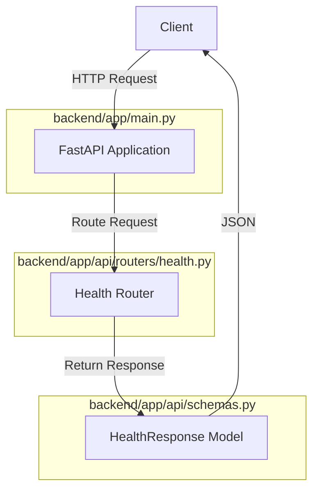
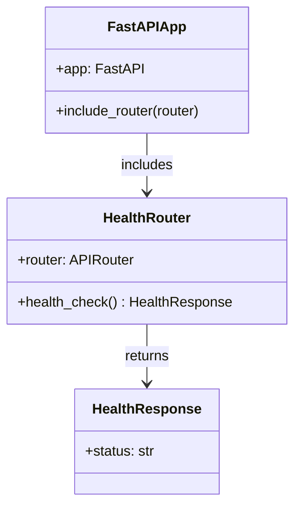
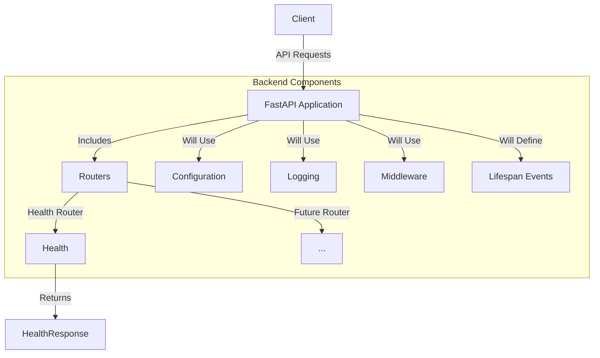

# AI Video Creation Platform - Health Endpoint Architecture

## Architecture Overview

Below is a visualization of the components we're implementing:

This diagram illustrates how the different components interact in the health endpoint implementation. The client makes an HTTP request to the FastAPI application, which routes the request to the Health Router, which returns a response using the HealthResponse model.

## Component Relationships

The health endpoint implementation consists of three main files, each with a specific responsibility:

This class diagram shows the relationships between the components. The FastAPI application includes the Health Router, which returns a HealthResponse object.

## Integration with Project Architecture

This health endpoint implementation is just the beginning of the AI Video Creation Platform. Here's how it fits into the larger architecture:

This diagram shows how our health endpoint implementation fits into the larger architecture of the AI Video Creation Platform. We're implementing the most basic component now, but the architecture is designed to be extended with additional routers, middleware, logging, and configuration in the future.

## Benefits of This Architecture

1. **Modularity**: Each component has a single responsibility, making the code easier to maintain and extend.
2. **Scalability**: New endpoints can be added by creating new routers and including them in the main application.
3. **Standardization**: Using Pydantic models for request/response validation ensures consistent API behavior.
4. **Async-First**: The implementation follows FastAPI's async-first approach, which allows for efficient handling of concurrent requests.
5. **Documentation**: FastAPI automatically generates OpenAPI documentation based on the router and model definitions.

## Testing Strategy

After implementation, we should test:

1. Application startup with `uvicorn backend.app.main:app --reload`
2. HTTP GET request to `/health` endpoint returns `{"status": "ok"}`
3. OpenAPI documentation is generated correctly at `/docs` and `/redoc`
