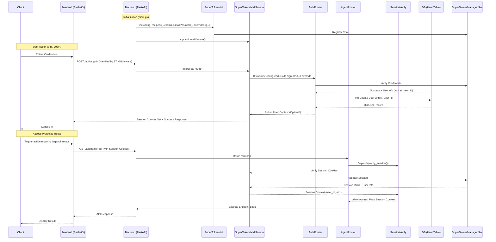

# SuperTokens Authentication Integration Plan (Task 4a)

**Goal:** Implement core authentication (Sign Up, Sign In, Sign Out, Session Management) using SuperTokens Managed Service and protect the `/agent/interact` API endpoint.

**Phase:** Proof of Concept (PoC)

**Key Technologies:**
*   Backend: FastAPI, SQLAlchemy, Alembic, `supertokens-python-sdk` (v0.29.1)
*   Frontend: SvelteKit, `supertokens-web-js`
*   Database: PostgreSQL
*   Authentication Provider: SuperTokens Managed Service (Free Tier)

---

## Detailed Plan:

### 1. Backend Setup (FastAPI - `backend/`)

*   **1.1. Add Dependency:**
    *   Add `supertokens-python-sdk` version `0.29.1` to `backend/pyproject.toml` (using Poetry or manually editing + `poetry lock && poetry install`).
*   **1.2. Configuration:**
    *   Add SuperTokens connection URI and API key to backend configuration (e.g., `.env` file and `backend/app/config.py`). Use placeholder names like `SUPERTOKENS_CONNECTION_URI` and `SUPERTOKENS_API_KEY`.
    *   Define App Name and API Domain in the configuration.
*   **1.3. SuperTokens Initialization:**
    *   In `backend/app/main.py`:
        *   Import necessary SuperTokens modules.
        *   Initialize SuperTokens with the configured settings (connection URI, API key, app name, API domain, website domain).
        *   Specify the required recipes: `Session`, `EmailPassword`.
        *   Add the SuperTokens FastAPI middleware to the app.
*   **1.4. Database Model Update:**
    *   Modify `backend/app/db/models.py`:
        *   Add a new column `supertokens_user_id` to the `User` model: `Mapped[str] = mapped_column(String, unique=True, index=True, nullable=True)`. Make it nullable initially to handle existing users without a SuperTokens ID.
*   **1.5. Database Migration:**
    *   Generate a new Alembic migration script: `alembic revision --autogenerate -m "Add supertokens_user_id to users table"`
    *   Review the generated migration script in `backend/app/db/migrations/versions/`.
    *   Apply the migration: `alembic upgrade head` (This step will be executed later by the `code` mode).
*   **1.6. User Linking Override:**
    *   In a suitable location (e.g., `backend/app/features/auth/supertokens_overrides.py`):
        *   Implement the `override` interface for the `EmailPassword` recipe's `signUpPOST` and `signInPOST` APIs.
        *   **`signUpPOST` Override:** After SuperTokens successfully creates a user, retrieve the `supertokens_user_id` and the user's `email`. Check if a user with this email already exists in *our* `users` table.
            *   If yes: Update the existing user record to set the `supertokens_user_id`.
            *   If no: Create a *new* record in our `users` table with the `email` and `supertokens_user_id`.
        *   **`signInPOST` Override:** After SuperTokens successfully authenticates a user, retrieve the `supertokens_user_id` and `email`. Check if a user exists in our `users` table with this `supertokens_user_id`.
            *   If yes: Proceed.
            *   If no: Check if a user exists with the `email` but `supertokens_user_id` is NULL. If yes, update the record with the `supertokens_user_id`. If no user exists with that email either, this indicates an inconsistency (should ideally not happen if sign-up logic is correct), log a warning.
        *   Ensure database operations within overrides use the correct session management (e.g., using FastAPI dependencies).
    *   Register these overrides during SuperTokens initialization in `main.py`.
*   **1.7. API Protection:**
    *   In the router file containing the `/agent/interact` endpoint (likely needs to be created, perhaps `backend/app/api/routers/agent.py`):
        *   Import the SuperTokens `SessionContainer` dependency.
        *   Add the `SessionContainer` as a dependency to the `/agent/interact` route function. This automatically verifies the session.
        *   Optionally, access user information (like `supertokens_user_id`) from the session object if needed within the endpoint logic.

### 2. Frontend Setup (SvelteKit - `frontend/`)

*   **2.1. Add Dependency:**
    *   Add `supertokens-web-js` to `frontend/package.json` (using `pnpm add supertokens-web-js`).
*   **2.2. Configuration:**
    *   Configure SuperTokens frontend SDK settings (API Domain, Website Domain, App Name) likely in a config file or directly in the initialization code, potentially using environment variables (`.env`).
*   **2.3. SuperTokens Initialization:**
    *   In `frontend/src/hooks.client.js` (or a dedicated auth module imported there):
        *   Import necessary SuperTokens modules (`webJs`).
        *   Initialize SuperTokens with the configured settings.
        *   Specify the required recipes: `Session`, `EmailPassword`.
*   **2.4. Integrate Pre-built UI:**
    *   Create a catch-all route: `frontend/src/routes/auth/[[...path]].svelte`.
    *   Inside this file, import and render the `SuperTokens` component from `supertokens-web-js/svelte`. This will handle rendering the correct UI for login, signup, password reset links (though reset functionality is deferred), etc.
    *   Ensure SvelteKit routing allows this catch-all to function correctly.
*   **2.5. Session Management & UI:**
    *   Use SuperTokens Svelte helpers (e.g., `SessionAuth` component or `useSessionContext` hook) in `frontend/src/routes/+layout.svelte` or specific pages (`+page.svelte`) to:
        *   Conditionally render UI elements based on authentication status (e.g., show "Login" or "Logout" button).
        *   Protect client-side routes/pages if necessary (though API protection is the primary focus for PoC).
    *   Implement a "Logout" button that calls the SuperTokens `signOut` function.
*   **2.6. API Client Integration:**
    *   Ensure the existing API client (`frontend/src/lib/services/apiClient.ts`) or any `fetch` calls made to the protected `/agent/interact` endpoint automatically handle SuperTokens session tokens (SuperTokens' `fetch` wrapper usually handles this automatically if initialized correctly).

### 3. Memory Bank Updates

*   **3.1. `decisionLog.md`:** Add entry for choosing SuperTokens Managed Service and pre-built UI for PoC.
*   **3.2. `progress.md`:** Break down Task `4a` into the detailed sub-tasks outlined above (1.1 - 2.6).
*   **3.3. `systemPatterns.md`:** Add patterns related to SuperTokens initialization (backend/frontend), middleware usage, session verification dependency, and UI integration route.
*   **3.4. `activeContext.md`:** Update current focus to "Implementing SuperTokens Authentication (Task 4a)".

---

## Visual Overview (Mermaid Diagrams):

### Backend Initialization & Request Flow:



### Frontend Initialization & UI:

```mermaid
graph TD
    subgraph Browser
        A[User Visits Site] --> B(SvelteKit App Loads);
        B --> C{hooks.client.js};
        C --> D[SuperTokensWebJS.init(...)];
        D --> E[ST Config (API Domain, App Name)];
        D --> F[Recipes: Session, EmailPassword];
        B --> G[Router];
        G -- /auth/[[...path]] --> H(Auth Catch-all Route);
        H --> I[Render SuperTokens Pre-built UI];
        G -- Other Routes --> J[App Layout/Pages];
        J --> K{useSessionContext / SessionAuth};
        K --> L[Conditionally Render UI (Login/Logout)];
        L -- Logout Click --> M[SuperTokensWebJS.signOut()];
        J -- API Call --> N[apiClient.ts / fetch];
        N --> O[Protected Backend API];
        subgraph SuperTokens SDK
            D; F; M; K; I;
        end
    end

    subgraph Backend
        O; P[SuperTokens Middleware];
    end

    O <-. Automatically includes session tokens .-> P;

    style Browser fill:#f9f,stroke:#333,stroke-width:2px;
    style Backend fill:#ccf,stroke:#333,stroke-width:2px;
