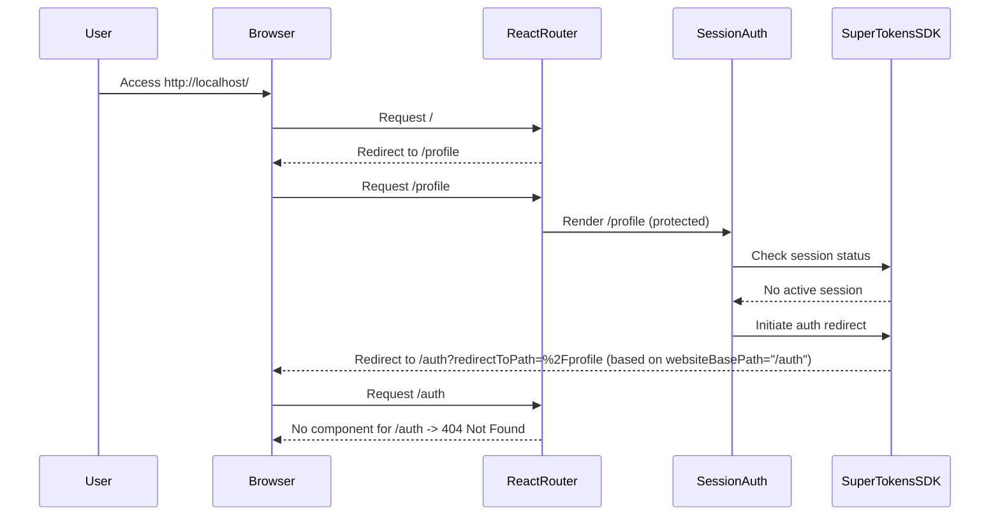

# SuperTokens Frontend Redirect Troubleshooting Plan

## 1. Problem Description

When accessing the root URL (`http://localhost/`), the Vite/React application immediately redirects to `http://localhost/auth/?redirectToPath=%2Fprofile`, resulting in a `404 Not Found` error. The console indicates this redirect is initiated by SuperTokens (`redirectToAuth`). The expected behavior is to see a public page or the login UI, not a 404.

## 2. Analysis

The root cause is a mismatch between the SuperTokens frontend configuration and the React Router setup:

*   **SuperTokens Config (`frontend-react/src/config/supertokens.ts`):** The `websiteBasePath` is set to `/auth`. This tells the SuperTokens SDK that the authentication UI (login/signup pages) resides at the `/auth` path.
*   **React Router (`frontend-react/src/routes/index.tsx`):** The router defines routes for `/auth/login` and `/auth/signup`, but *no route* is defined for the base `/auth` path itself.
*   **Flow:**
    1.  User hits `/`.
    2.  Router redirects `/` to `/profile`.
    3.  `/profile` is protected by `<SessionAuth>`.
    4.  `<SessionAuth>` finds no active session and triggers a SuperTokens redirect.
    5.  SuperTokens redirects to `websiteBasePath` (`/auth`) with the original path appended (`/auth?redirectToPath=%2Fprofile`).
    6.  React Router receives the request for `/auth` but finds no matching component, leading to the 404.

## 3. Relevant Files Examined

*   `frontend-react/src/config/supertokens.ts` (SuperTokens frontend config)
*   `frontend-react/src/routes/index.tsx` (React Router setup)
*   `frontend-react/src/pages/auth/LoginPage.tsx` (Login page component, confirmed signup link exists)
*   `memory-bank/*.md` (Project context)

## 4. Proposed Solution (Option A - Recommended)

Modify the SuperTokens frontend configuration to align the redirect target with an existing route.

*   **File:** `frontend-react/src/config/supertokens.ts`
*   **Change:** Modify line 17 from `websiteBasePath: "/auth"` to `websiteBasePath: "/auth/login"`.

## 5. Rationale for Option A

*   Directly fixes the 404 by telling SuperTokens to redirect unauthenticated users to the actual login page component (`/auth/login`), which has a defined route.
*   The sign-up process is unaffected, as the `LoginPage` component contains a link to `/auth/signup`.

## 6. Alternative Solution (Option B - Not Recommended)

Modify the React Router to handle the `/auth` path directly.

*   **File:** `frontend-react/src/routes/index.tsx`
*   **Change:** Add an `index` route within the `/auth` parent route: `<Route index element={<LoginPage />} />`.
*   **Rationale:** Makes the `/auth` path render the login page, satisfying the original `websiteBasePath: "/auth"` config. Less direct than Option A.

## 7. Verification Steps

1.  Apply the code change (Option A).
2.  Restart the frontend development server (`npm run dev` or similar).
3.  Clear browser cache/cookies for `http://localhost`.
4.  Access `http://localhost/`.
5.  **Expected:** Redirect to `http://localhost/auth/login?redirectToPath=%2Fprofile` (Login page should render).
6.  Verify the "Create account" link on the login page works and navigates to `/auth/signup`.

## 8. Problem Flow Diagram

## 9. Next Step

Switch to **Code Mode** to apply the fix described in Option A to the `frontend-react/src/config/supertokens.ts` file.
